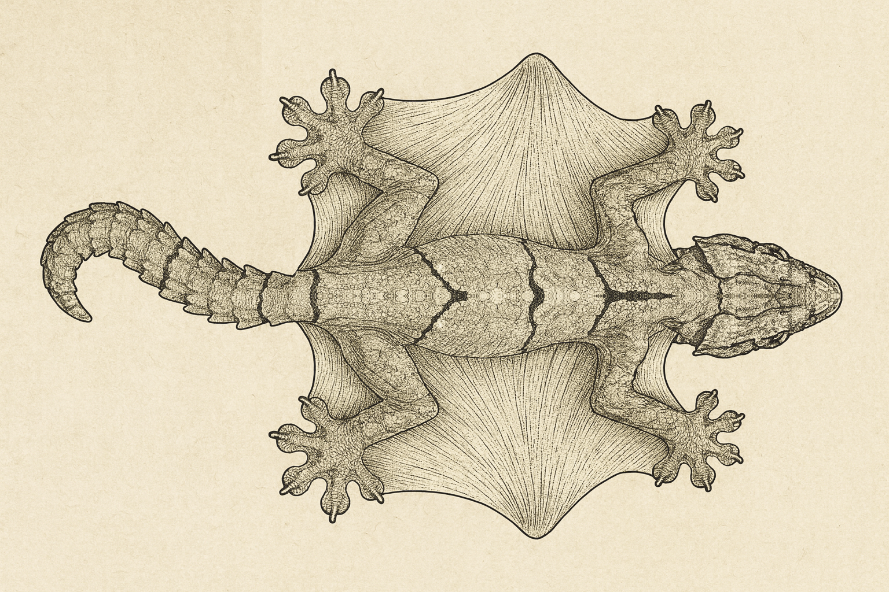
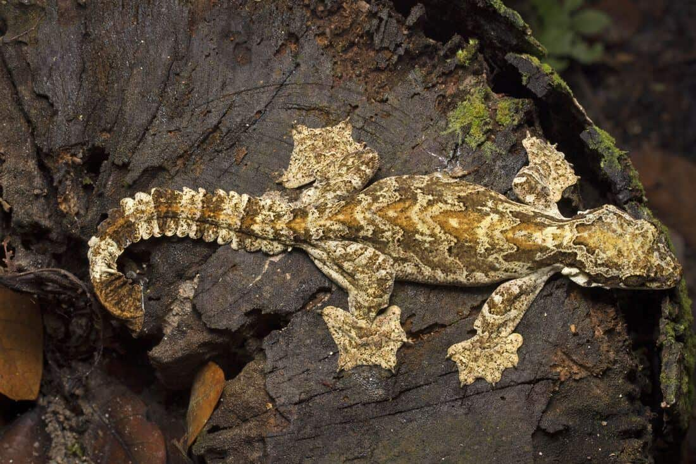

# structural-hallucination-ai

🧬 Structural Hallucinations in Diffusion Models

Addressing Anatomical Consistency in Generative AI

Author: Kadin Shino · October 2025

Abstract

Diffusion-based image generators exhibit structural hallucinations—anatomical errors that arise even when starting from accurate references. A recurrent case appears in reptiles such as Ptychozoon kuhli (the flying gecko), where models consistently produce an additional limb attached to the torso.
This issue does not appear in mammals such as horses or dogs, revealing an uneven internal representation of anatomical priors across taxa.

This paper documents the discovery, identifies underlying technical causes, and proposes implementable fixes at the architecture, data, and validation levels.

1. Introduction

Recent diffusion and multimodal models (DALL-E, Sora, Grok Vision, etc.) achieve remarkable photorealism, yet remain semantically accurate but anatomically inconsistent.
When tasked to “generate or stylize” a flying gecko from a correct reference, several models introduced an extra arm on the torso, forming a five-limbed structure biologically impossible for any vertebrate.

The same generators correctly handled horses and dogs, preserving the correct four-limb topology even when occlusion or overlapping limbs might confuse perception.
This asymmetry exposes a weakness in how current models encode structural priors.

2. The Discovery

While prototyping a 3D-printable “gliding gecko” toy, reference imagery of Ptychozoon kuhli was used as the generation base. Despite explicit prompts and correct inputs, every diffusion system tested produced at least one of the following:

An extra limb anchoring the membrane mid-torso.

Displaced shoulder/hip alignment.

Inverted limb rotation inconsistent with any vertebrate body plan.

When the same process was applied to a horse reference (Fig. 2), models preserved correct leg count and orientation even with motion blur or overlap.
This difference prompted deeper investigation into why the anatomical integrity of common mammals holds, while reptiles degrade.

3. Root Causes

3.1 Weak Topological Priors

Diffusion models learn pixel-to-feature correlations, not biomechanical structure.
During denoising, ambiguous regions (e.g., patagial membranes) are “completed” as new appendages since the network lacks a skeletal constraint to stop it.

3.2 Dataset Contamination

The semantic cluster for “reptile” overlaps heavily with dragons, dinosaurs, and fantasy concept art, many of which show six limbs or fused wings.
The model thus learns “reptile-like creature” as a probabilistic blend that tolerates extra limbs.

3.3 Low-Contrast and Ambiguous Silhouettes

Gliding lizards have soft limb-to-body transitions, especially around membranes.
This confuses the U-Net’s edge and joint detectors, leading to redundant appendage reconstruction.

3.4 Lack of Reinforcement for Structural Accuracy

Reinforcement fine-tuning (RLHF or aesthetic alignment) strongly penalizes malformed mammals but rarely includes rare taxa.
No equivalent signal exists to tell the model a “five-limbed gecko” is wrong.

3.5 Over-Symmetrization Bias

Diffusion models favor symmetrical patterns; a misplaced edge on one side is mirrored onto the other, effectively doubling a limb.

4. Why Mammals Don’t Break

Quadrupeds like horses and dogs appear immune to this issue due to:

Massive, clean training data with consistent limb counts.

Strong RLHF penalties for “deformed animals.”

High-contrast silhouettes separating limbs from body.

Cultural image saturation—billions of images enforcing the same body plan.

In short, the model’s internal manifold for “dog” or “horse” includes a hard limb-count constraint learned implicitly through data redundancy.
By contrast, “reptile” is a soft manifold contaminated with artistic and hybrid examples.

5. Proposed Technical Solutions
5.1 Topology-Constrained Diffusion

Inject a pose or skeleton conditioning channel (e.g., via OpenPose or DensePose) into the denoising process.
This provides explicit spatial anchors that prevent spurious limb formation.

[Fig. 1 – Gecko Reference vs. AI Output]

5.2 Body-Plan Validation Module

After generation, apply a morphological validator:

Segment the subject.

Detect connected appendages via contour or skeletonization.

Compare to species template (e.g., vertebrate = 4 limbs).

Flag or discard anomalies automatically.

[Fig. 2 – Validation Pipeline Diagram]
(Placeholder: shows segmentation, limb detection, and comparison stages)

5.3 Hierarchical Anatomical Embedding

Add structural tokens (e.g., head, torso, limb, tail) to embeddings.
The model learns relative positions and constraints directly in latent space.

5.4 Selective Fine-Tuning for Underrepresented Taxa

Assemble small, verified datasets of reptiles, amphibians, and flying species with accurate limb annotations.
Fine-tune models to strengthen these priors.

5.5 User-Level Control (Pose Locking)

Expose a “pose-lock” option through ControlNet or adapter layers, allowing users to enforce existing limb positions without modifying text prompts.

6. Implications

Reliability: Prevents biologically impossible structures in scientific or educational outputs.

Creative Control: Enables anatomically grounded creature design for art, games, and toy production.

AI Safety: Offers a testbed for general structural consistency validation — extending beyond anatomy to mechanical design and robotics.

Research Potential: Opens a new subfield: biomechanically aware diffusion.

7. Conclusion

The extra-limb phenomenon demonstrates a fundamental gap between semantic understanding and geometric reasoning in generative AI.
Models excel at reproducing style and texture but lack a concept of “possible anatomy.”
By integrating topology-aware conditioning and post-generation validation, we can bridge that gap—producing models that understand how a creature should exist, not merely how it should look.

Keywords

structural hallucination, anatomical consistency, topology constraint, ControlNet, pose-guided diffusion, biomechanical prior, dataset contamination, flying gecko

Author: Kadin Shino
License: CC BY-SA 4.0
(Open publication — GitHub distribution encouraged.)